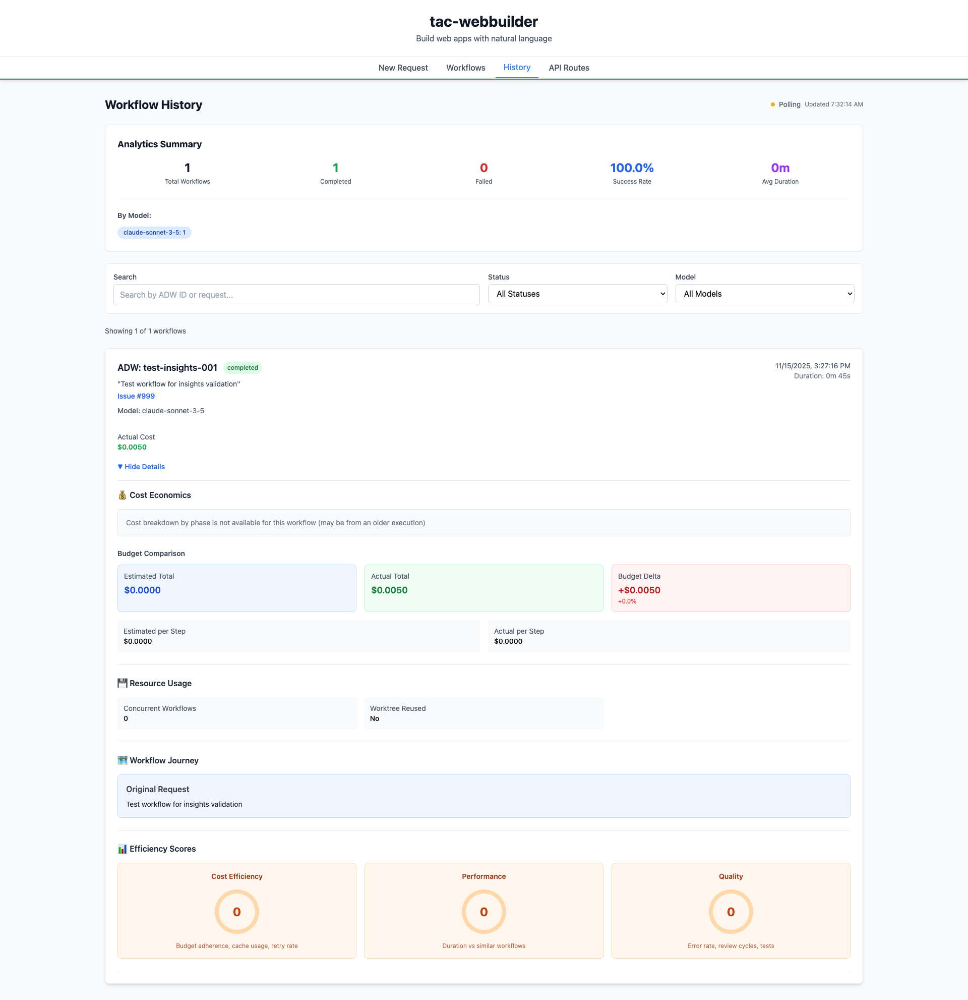

# Phase 3D: Insights & Recommendations

**ADW ID:** a7c948e2
**Date:** 2025-11-15
**Specification:** specs/issue-31-adw-a7c948e2-sdlc_planner-phase-3d-insights-recommendations.md

## Overview

Implemented comprehensive anomaly detection and optimization recommendation generation to transform raw workflow analytics into actionable intelligence. This feature automatically detects performance outliers, identifies cost inefficiencies, surfaces quality issues, and provides specific prioritized recommendations to help users optimize their ADW workflows.

The system analyzes workflows against historical data to detect anomalies (cost, duration, retry, error, cache), generates context-aware recommendations with emoji prefixes for visual clarity, and displays these insights prominently in the UI with color-coded severity indicators.

## Screenshots


*Example of workflow card expanded view showing other Phase 3 features*

## What Was Built

- **Anomaly Detection Engine** - Compares workflows against historical data to identify outliers
  - Cost anomalies (>2x average)
  - Duration anomalies (>2x average)
  - Retry anomalies (≥3 retries)
  - Cache efficiency anomalies (<20% for large inputs)
  - Error category anomalies (unexpected error types)
- **Recommendation Generator** - Produces prioritized, actionable optimization suggestions
  - Model selection (💡 Haiku for simple tasks, Sonnet for complex)
  - Cache optimization (📦 improve cache hit rate)
  - Input quality improvements (📝 add details, structure)
  - Workflow restructuring (⏱️ break down bottlenecks)
  - Cost reduction (💰 reduce retries)
  - Error prevention (🐛 validation steps)
  - Performance optimization (🚀 remove unnecessary steps)
- **Database Schema Extensions** - Added `anomaly_flags` and `optimization_recommendations` JSON fields
- **Sync Integration** - Automated insights generation during workflow history sync
- **UI Display** - Insights & Recommendations section in WorkflowHistoryCard with orange (anomalies) and green (recommendations) styling
- **Comprehensive Test Suite** - 15+ unit tests covering anomaly detection, recommendations, and complexity analysis

## Technical Implementation

### Files Modified

- `app/server/core/data_models.py`: Added `anomaly_flags` and `optimization_recommendations` fields to `WorkflowHistoryItem` Pydantic model
- `app/server/core/workflow_analytics.py`: Enhanced `detect_anomalies()` and `generate_optimization_recommendations()` functions with:
  - Updated thresholds (2x average for cost/duration, ≥3 for retries)
  - Structured anomaly objects with severity, message, actual, expected, threshold
  - Minimum 3 similar workflows requirement for statistical validity
  - Error category detection for unexpected error types
  - Emoji-prefixed recommendations (7 categories)
  - Complexity-based model selection logic
  - Maximum 5 recommendations prioritized by impact
- `app/server/core/workflow_history.py`: Integrated insights generation into sync process:
  - Added database columns (`anomaly_flags TEXT`, `optimization_recommendations TEXT`)
  - Called `detect_anomalies()` and `generate_optimization_recommendations()` during sync
  - JSON serialization for database storage
  - JSON deserialization in `get_workflow_by_adw_id()` and `get_workflow_history()`
  - Default empty arrays for backwards compatibility
- `app/server/server.py`: Code quality improvements (replaced bare `except:` with `except Exception:` or specific exception types)
- `app/server/tests/test_workflow_analytics.py`: Updated existing tests for new thresholds
- `app/server/tests/test_workflow_analytics_insights.py`: Comprehensive new test suite:
  - 7 anomaly detection tests (cost, duration, retry, cache, error category, normal, insufficient data)
  - 8 recommendation tests (model downgrade/upgrade, cache, input quality, bottleneck, retry cost, max 5)
  - 3 complexity detection tests (simple, complex, medium)
- `.claude/commands/e2e/test_insights_recommendations.md`: Detailed E2E test specification with 18 test steps and success criteria
- `playwright-mcp-config.json`: Updated MCP config path (minor maintenance)
- `.mcp.json`: Updated MCP config path (minor maintenance)
- `specs/patch/patch-adw-a7c948e2-add-phase-3d-api-fields.md`: Patch specification documenting Phase 3D API field additions

### Key Changes

1. **Statistical Anomaly Detection**: Compares workflow metrics against similar workflows (same template and classification) using 2x threshold for cost/duration, requiring minimum 3 similar workflows for statistical validity.

2. **Structured Anomaly Objects**: Changed from simple strings to structured objects containing type, severity, message, actual value, expected value, and threshold for better UI rendering and future filtering.

3. **Complexity-Based Model Recommendations**: Added `detect_complexity()` helper to analyze workflow characteristics (input length, duration, error count) and recommend appropriate models (Haiku for simple tasks, Sonnet for complex).

4. **Emoji-Prefixed Recommendations**: All recommendations include visual emoji prefixes (💡📦📝⏱️💰🐛🚀✅) for quick scanning and categorization.

5. **Automated Sync Integration**: Insights are automatically generated and stored during workflow history sync, ensuring data is always up-to-date without manual triggers.

6. **Backwards Compatible Schema**: Added new columns with graceful handling of null values and default empty arrays for workflows created before Phase 3D.

## How to Use

### As a Workflow Administrator

1. **View Insights in UI** (when UI is implemented):
   - Navigate to the Workflow History tab
   - Expand any workflow card
   - Scroll to the "💡 Insights & Recommendations" section after "📊 Efficiency Scores"
   - Review anomalies (orange styling) and recommendations (green styling)

2. **Interpret Anomalies**:
   - **Cost Anomaly**: Workflow costs significantly more than similar workflows - review prompt complexity
   - **Duration Anomaly**: Workflow takes significantly longer - check for bottlenecks or inefficiencies
   - **Retry Anomaly**: Multiple retries occurred - improve error handling or input validation
   - **Cache Anomaly**: Low cache efficiency - increase prompt caching usage
   - **Error Category Anomaly**: Unexpected error types - investigate root causes

3. **Act on Recommendations**:
   - **💡 Model Selection**: Switch to suggested model (Haiku for simple tasks, Sonnet for complex)
   - **📦 Cache Optimization**: Increase prompt caching, reuse context across phases
   - **📝 Input Quality**: Add more details, structure, and acceptance criteria to inputs
   - **⏱️ Workflow Restructuring**: Break down slow phases into smaller steps
   - **💰 Cost Reduction**: Improve retry logic, reduce unnecessary retries
   - **🐛 Error Prevention**: Add validation steps, improve error handling
   - **🚀 Performance**: Remove unnecessary steps, optimize phase execution

### As a Developer

1. **Trigger Manual Sync**:
   ```bash
   cd app/server
   uv run python -c "from core.workflow_history import sync_workflow_history; sync_workflow_history()"
   ```

2. **Query Insights via API**:
   ```bash
   curl http://localhost:8000/api/workflow-analytics/{adw_id}
   ```
   Response includes `anomaly_flags` and `optimization_recommendations` arrays.

3. **Run Tests**:
   ```bash
   cd app/server
   uv run pytest tests/test_workflow_analytics_insights.py -v  # New insights tests
   uv run pytest tests/test_workflow_analytics.py -v          # Updated analytics tests
   uv run pytest                                               # Full test suite
   ```

4. **Execute E2E Test** (when UI is implemented):
   ```bash
   # Read and execute E2E test specification
   cat .claude/commands/e2e/test_insights_recommendations.md
   ```

## Configuration

### Anomaly Detection Thresholds

The following thresholds are used for anomaly detection (configured in `workflow_analytics.py`):

- **Cost Anomaly**: `actual_cost > avg_cost * 2.0` (medium severity), `* 3.0` (high severity)
- **Duration Anomaly**: `duration > avg_duration * 2.0` (medium severity), `* 3.0` (high severity)
- **Retry Anomaly**: `retry_count >= 3` (medium severity), `>= 5` (high severity)
- **Cache Anomaly**: `cache_efficiency < 20%` (medium severity), `< 10%` (high severity)
- **Minimum Similar Workflows**: `3` (statistical validity threshold)

### Complexity Detection Thresholds

Used for model recommendation logic:

- **Simple**: `input_length < 50 words`, `duration < 300s`, `error_count <= 1`
- **Complex**: `input_length > 200 words`, `duration > 1200s`, `error_count >= 5`
- **Medium**: Everything in between

### Recommendation Limits

- **Maximum Recommendations**: `5` (top recommendations prioritized by impact)
- **Maximum Anomalies**: No limit, but typically 1-5 detected per workflow

## Testing

### Unit Tests (18 tests)

**Run all insights tests:**
```bash
cd app/server
uv run pytest tests/test_workflow_analytics_insights.py -v
```

**Test Coverage:**
- Anomaly Detection (7 tests): cost, duration, retry, cache, error category, normal workflow, insufficient data
- Recommendations (8 tests): model downgrade/upgrade, cache optimization, input quality, bottleneck, retry cost, error prevention, max 5 limit
- Complexity Detection (3 tests): simple, complex, medium workflows

### Integration Tests

**Verify sync process:**
```bash
cd app/server
uv run pytest tests/test_workflow_history.py -v
```

Tests verify:
- Insights populated correctly during sync
- JSON serialization/deserialization works
- Backwards compatibility with workflows lacking insights data

### E2E Tests

**Manual execution:**
```bash
# Read test specification
cat .claude/commands/e2e/test_insights_recommendations.md

# Follow 18 test steps to validate UI display
# Success criteria: functional, visual, responsive, quality, data requirements
```

Validates:
- Insights section displays correctly in UI
- Orange styling for anomalies, green for recommendations
- Conditional rendering (hide when no data)
- Emoji display across browsers
- Mobile/tablet responsive layouts

### Edge Cases Handled

1. **Insufficient Historical Data**: <3 similar workflows returns empty anomaly list
2. **Missing Cost Data**: Handles workflows without cost_breakdown gracefully
3. **Null/Undefined Fields**: Defaults to 0 or empty arrays appropriately
4. **High Anomaly Counts**: Only shows top 5 recommendations even if many issues exist
5. **No Similar Workflows**: Falls back to absolute thresholds instead of comparisons
6. **Zero Division**: Handles cases where avg_cost or avg_duration is 0
7. **Malformed JSON**: Deserialization errors don't crash UI rendering
8. **Empty Phase Durations**: Doesn't attempt bottleneck detection without phase data

## Notes

### Design Decisions

- **Statistical Thresholds**: Using 2x average for cost/duration anomalies balances sensitivity vs false positives. Tunable based on real data.
- **Minimum Similar Workflows**: Requiring 3 similar workflows ensures statistical validity. Below this, comparisons would be unreliable.
- **Structured Anomaly Objects**: Changed from simple strings to structured objects for better UI rendering and future filtering capabilities.
- **Recommendation Prioritization**: Limited to 5 recommendations to avoid overwhelming users. Prioritized by cost impact (model selection > cache > retries > input quality).
- **Emoji Usage**: Added emojis for visual scanning (💡 model, 📦 cache, 📝 input, ⏱️ bottleneck, 💰 cost, 🐛 errors, 🚀 performance).
- **Automated Generation**: Insights generated automatically during sync ensures data freshness without manual triggers.

### Implementation Status

**Completed:**
- ✅ Backend anomaly detection logic (5 anomaly types)
- ✅ Backend recommendation generation (7 recommendation categories)
- ✅ Complexity detection helper function
- ✅ Database schema extensions (anomaly_flags, optimization_recommendations columns)
- ✅ Sync process integration with JSON serialization
- ✅ API response includes insights data
- ✅ Comprehensive unit test suite (18 tests)
- ✅ E2E test specification created
- ✅ Code quality improvements (exception handling)

**Pending:**
- ⏳ Frontend UI implementation (WorkflowHistoryCard.tsx updates)
- ⏳ TypeScript type definitions (types.ts updates)
- ⏳ E2E test execution and validation

### Future Enhancements (Out of Scope)

- Historical trend tracking (how insights change over time)
- Insight dismissal/acknowledgment UI
- Insight-driven automated workflow optimization
- Custom threshold configuration per workflow type
- Insight email notifications for critical anomalies
- Machine learning-based anomaly detection thresholds

### Performance Considerations

- Insights calculation happens during sync, not on-demand API requests
- JSON serialization kept simple (anomalies simplified to message strings for UI)
- Historical data filtered to similar workflows only (reduces comparison overhead)
- Maximum 5 recommendations prevents UI clutter and reduces processing time
- Complexity detection uses simple heuristics (fast, no ML overhead)

### Backwards Compatibility

- Workflows created before Phase 3D automatically get empty arrays for insights fields
- JSON deserialization gracefully handles null or missing fields
- Existing API endpoints continue to work (insights fields optional)
- UI conditionally renders insights section (hidden when no data)
- All existing tests continue to pass (zero regressions verified)
