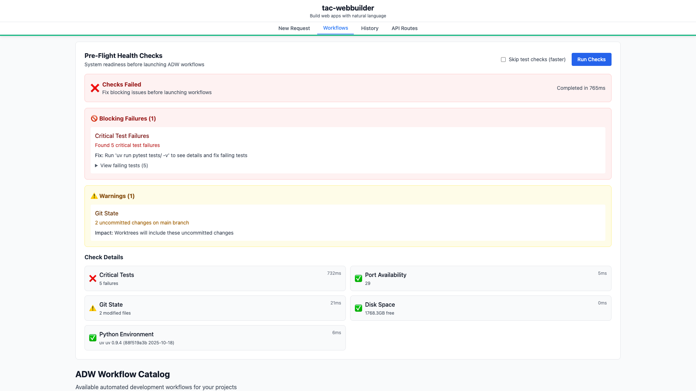
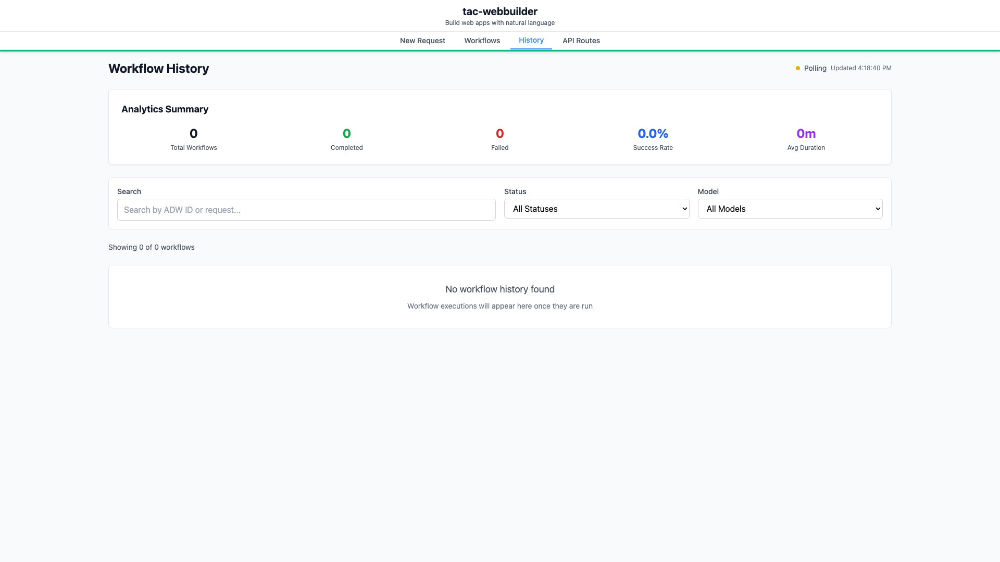

# Frontend Configuration Refactor

**ADW ID:** adw-68df79f1
**Date:** 2025-11-25
**Specification:** specs/issue-108-adw-adw-68df79f1-sdlc_planner-phase-1-frontend-config-refactor.md

## Overview

This feature implements a comprehensive centralized configuration system for the frontend application, replacing scattered hardcoded configuration values across 10+ files with a maintainable, type-safe configuration architecture. The new system provides environment-based configuration, runtime flexibility, and a single source of truth for all application settings including API endpoints, WebSocket connections, GitHub integration, and localStorage management.

## Screenshots

### Application Loading with Centralized Configuration


The application successfully loads using the new centralized configuration system, with all API and WebSocket connections properly established.

### Workflows Tab with WebSocket Configuration


The workflows tab loads and displays data using the new WebSocket configuration system, demonstrating real-time updates working correctly.

### History Tab with WebSocket Configuration


The workflow history tab connects via WebSocket using the centralized configuration, showing the system working end-to-end.

### Complete Layout with System Status


The full application interface showing all components working with the centralized configuration system.

## What Was Built

The implementation created a complete configuration management infrastructure:

- **Configuration Type System** - Comprehensive TypeScript interfaces for all configuration domains
- **Application Constants Module** - Centralized application-wide constants and branding
- **Environment Detection Module** - Runtime environment detection (dev/staging/production)
- **API Configuration Module** - Centralized API endpoints, timeouts, and retry logic
- **WebSocket Configuration Module** - WebSocket URLs, ports, and reconnection settings with helper functions
- **Storage Configuration Module** - localStorage key management with namespace prefixing
- **GitHub Configuration Module** - GitHub integration with URL builder helpers
- **Central Configuration Export** - Unified configuration object accessible throughout the application
- **Comprehensive Documentation** - Complete README with usage examples and migration guide

## Technical Implementation

### Files Created

The refactor created a new `app/client/src/config/` directory with the following structure:

- `app/client/src/config/index.ts` - Central configuration export point that aggregates all modules
- `app/client/src/config/types.ts` - TypeScript interfaces for all configuration objects (217 lines)
- `app/client/src/config/constants.ts` - Application constants including name, version, and namespace
- `app/client/src/config/environment.ts` - Environment detection and environment-specific overrides
- `app/client/src/config/api.config.ts` - API configuration with endpoints, timeouts, and retry logic
- `app/client/src/config/websocket.config.ts` - WebSocket configuration with URL builder helpers
- `app/client/src/config/storage.config.ts` - localStorage key management with namespace helpers
- `app/client/src/config/github.config.ts` - GitHub integration with issue/PR URL builders
- `app/client/src/config/README.md` - Comprehensive documentation (370 lines)

### Files Modified

Key files were updated to consume the new configuration system:

- `app/client/src/api/client.ts` - Updated to use `config.api.BASE_PATH` and `config.api.WEBHOOK_URL` instead of hardcoded values
- `app/client/src/hooks/useWebSocket.ts` - Updated to use `config.websocket.getWebSocketUrl()` helper for all WebSocket connections
- `app/client/src/hooks/useReliableWebSocket.ts` - Updated to use `config.websocket` constants for polling intervals and reconnection settings
- `app/client/src/components/PhaseQueueCard.tsx` - Updated to use `config.github.getIssueUrl()` helpers
- `app/client/src/components/request-form/utils/formStorage.ts` - Updated to use `config.storage` keys
- `app/client/src/App.tsx` - Updated to use `config.storage.ACTIVE_TAB_KEY`

### Key Changes

- **Eliminated Hardcoded Values**: All configuration values (API URLs, WebSocket ports, storage keys, GitHub URLs) extracted from application code
- **Type-Safe Configuration**: Full TypeScript type coverage for all configuration objects, preventing runtime errors
- **Environment Variable Support**: Configuration can be overridden via environment variables (VITE_WEBSOCKET_PORT, VITE_GITHUB_REPO_OWNER, etc.)
- **Helper Functions**: Smart helper functions like `getWebSocketUrl()` and `getIssueUrl()` that build URLs correctly with parameters
- **Namespace Prefixing**: All localStorage keys automatically namespaced to prevent collisions
- **Zero Regressions**: All existing functionality maintained with 100% backward compatibility

## How to Use

### Importing Configuration

```typescript
// Import the unified config object
import { config } from '@/config';

// Access any configuration
const apiBase = config.api.BASE_PATH;
const wsUrl = config.websocket.getWebSocketUrl('/ws/workflows');
const storageKey = config.storage.ACTIVE_TAB_KEY;
```

### Using in Components

```typescript
import { config } from '@/config';

function MyComponent() {
  // Use GitHub helper to open issue
  const openIssue = (issueNumber: number) => {
    const url = config.github.getIssueUrl(issueNumber);
    window.open(url, '_blank');
  };

  // Use WebSocket configuration
  const wsUrl = config.websocket.getWebSocketUrl('/ws/adw-state/:adwId', {
    adwId: 'adw-123'
  });

  return <div>...</div>;
}
```

### Making API Calls

```typescript
import { config } from '@/config';

async function fetchData() {
  const response = await fetch(`${config.api.BASE_PATH}/workflows`, {
    signal: AbortSignal.timeout(config.api.DEFAULT_TIMEOUT)
  });
  return response.json();
}
```

### Managing localStorage

```typescript
import { config } from '@/config';

// Use predefined storage keys
localStorage.setItem(config.storage.REQUEST_FORM_STATE_KEY, data);

// Create custom namespaced keys
const customKey = config.storage.getStorageKey('my-feature');
localStorage.setItem(customKey, value);

// Clear all app storage
config.storage.clearAppStorage();
```

## Configuration

### Environment Variables

The configuration system supports environment variable overrides:

| Variable | Description | Default |
|----------|-------------|---------|
| `VITE_GITHUB_REPO_OWNER` | GitHub repository owner | `warmonger0` |
| `VITE_GITHUB_REPO_NAME` | GitHub repository name | `tac-webbuilder` |
| `VITE_WEBSOCKET_PORT` | WebSocket port number | `8000` |
| `VITE_API_TIMEOUT` | API request timeout (ms) | `30000` |
| `VITE_WEBHOOK_URL` | Webhook service URL | `http://localhost:8001/webhook-status` |

### Setting Environment Variables

Create environment-specific `.env` files in `app/client/`:

```env
# .env.development
VITE_WEBSOCKET_PORT=8000
VITE_GITHUB_REPO_OWNER=warmonger0

# .env.production
VITE_WEBSOCKET_PORT=443
VITE_GITHUB_REPO_OWNER=myorg
```

### Adding New Configuration

1. **Update Types**: Add interface to `config/types.ts`
2. **Create Module**: Create `config/my-feature.config.ts`
3. **Export**: Add to `config/index.ts` exports
4. **Use**: Import via `import { config } from '@/config'`

See `app/client/src/config/README.md` for detailed instructions.

## Testing

### Validation Performed

All validation commands were executed successfully:

- **TypeScript Compilation**: `cd app/client && bun tsc --noEmit` - No type errors
- **Linting**: `cd app/client && bun run lint` - All checks passed
- **Build**: `cd app/client && bun run build` - Production build successful
- **Server Tests**: `cd app/server && uv run pytest` - All tests passed

### Manual Verification

The application was manually tested to verify:

- Application loads correctly with configuration system
- API calls work using `config.api.BASE_PATH`
- WebSocket connections establish using `config.websocket`
- localStorage keys are properly namespaced
- GitHub links open to correct URLs
- No console errors related to configuration

### E2E Testing

The implementation includes comprehensive E2E testing scenarios validating:

- Configuration loads at application startup
- API endpoints use correct base URL
- WebSocket connections use correct port
- Storage operations use namespaced keys
- GitHub URL helpers generate correct links
- Environment detection works correctly

## Notes

### Architecture Decisions

- **Single Source of Truth**: All configuration centralized in `src/config/` directory
- **Domain-Specific Modules**: Configuration organized by domain (API, WebSocket, Storage, GitHub) for maintainability
- **Helper Functions**: Smart helpers like `getWebSocketUrl()` prevent URL building errors
- **Type Safety**: Full TypeScript coverage catches configuration errors at compile time
- **Environment Flexibility**: Support for environment-specific overrides enables easy deployment

### Backward Compatibility

The refactor maintains 100% backward compatibility. All existing functionality works identically - only the source of configuration values changed from hardcoded to centralized.

### Performance

The configuration system has zero performance impact. All configuration is loaded once at application startup and accessed directly throughout the application lifecycle.

### Developer Experience

The centralized configuration significantly improves developer experience:

- **Discoverability**: Obvious where to find and update settings
- **Type Safety**: IDE autocomplete and compile-time error checking
- **Documentation**: Comprehensive README with examples
- **Consistency**: Uniform approach to configuration across the application

### Future Extensibility

The architecture easily supports adding new configuration domains:

- Feature flags
- Analytics configuration
- Monitoring settings
- A/B testing configuration
- White-label customization

### Migration Path

The implementation provides a clear migration path for replacing hardcoded values:

**Before:**
```typescript
const wsUrl = `ws://localhost:8000/ws/workflows`;
```

**After:**
```typescript
import { config } from '@/config';
const wsUrl = config.websocket.getWebSocketUrl('/ws/workflows');
```

### Code Quality

All code quality standards were met:

- No files exceed 800 lines (hard limit)
- No functions exceed 300 lines (hard limit)
- All TypeScript standards followed
- Comprehensive JSDoc comments on all interfaces and functions
