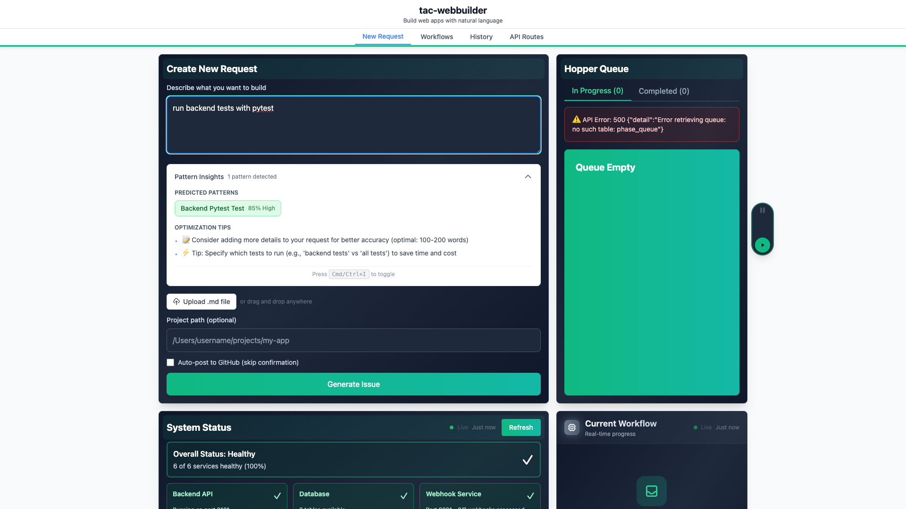
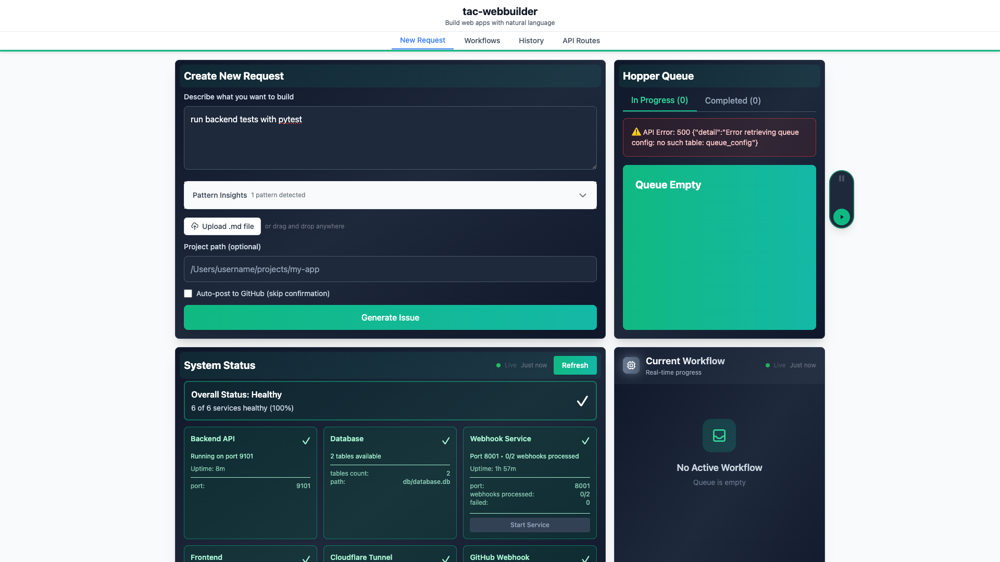

# Submission-Time Pattern Detection

**ADW ID:** adw-dd4189aa
**Date:** 2025-11-25
**Specification:** specs/issue-111-adw-adw-dd4189aa-sdlc_planner-phase-2-add-submission-time-pattern-detection.md

## Overview

Real-time pattern prediction and insights system that displays predicted operational patterns (e.g., "test:pytest:backend", "build:typecheck:frontend") to users as they type their workflow requests. This enables users to see confidence scores, similar historical workflows, and optimization recommendations before submitting, allowing them to refine inputs for better accuracy, lower costs, and faster execution.

## Screenshots






## What Was Built

- **Backend Pattern Prediction API** - `/api/predict-patterns` POST endpoint that analyzes natural language input and returns pattern predictions, similar workflows, and optimization recommendations
- **Real-Time Pattern Insights Panel** - Collapsible UI component displaying predictions with confidence-based color coding (green ≥75%, yellow 50-74%, gray <50%)
- **Pattern Badge Component** - Reusable badges showing individual pattern predictions with tooltips containing reasoning
- **Similar Workflow Cards** - Cards displaying 3-5 historically similar workflows with similarity scores, clarity scores, costs, and status
- **Debounced Prediction System** - 500ms debounced API calls that trigger when users type, preventing API spam
- **Optimization Recommendations Engine** - Rule-based recommendations generated from predicted patterns and historical workflow analysis

## Technical Implementation

### Files Modified

**Backend - New Pattern Prediction Routes:**
- `app/server/routes/pattern_routes.py` (229 additions) - New dedicated route module for `/api/predict-patterns` endpoint
- `app/server/tests/routes/test_pattern_routes.py` (236 additions) - Comprehensive pytest tests for pattern prediction endpoint

**Backend - Data Models:**
- `app/server/core/models/requests.py` (6 additions) - Added `PredictPatternsRequest` model
- `app/server/core/models/responses.py` (12 additions) - Added `PredictPatternsResponse` model
- `app/server/core/models/workflow.py` (18 additions) - Added `PatternPrediction` and `SimilarWorkflowSummary` models
- `app/server/core/data_models.py` (8 additions) - Exported new models from facade

**Backend - Server Registration:**
- `app/server/server.py` (5 additions) - Registered pattern routes in FastAPI app

**Frontend - React Components:**
- `app/client/src/components/request-form/PatternInsightsPanel.tsx` (189 additions) - Main UI component with collapsible sections for patterns, similar workflows, and recommendations
- `app/client/src/components/request-form/PatternBadge.tsx` (38 additions) - Badge component displaying pattern signature and confidence with color coding
- `app/client/src/components/request-form/SimilarWorkflowCard.tsx` (73 additions) - Card component showing historical workflow summary

**Frontend - Utilities:**
- `app/client/src/utils/debounce.ts` (34 additions) - Generic debounce utility with TypeScript generics
- `app/client/src/utils/patternFormatters.ts` (89 additions) - Pattern formatting utilities for human-readable display

**Frontend - Integration:**
- `app/client/src/components/RequestForm.tsx` (59 additions) - Integrated PatternInsightsPanel with debounced prediction fetching
- `app/client/src/api/client.ts` (37 additions) - Added `predictPatterns()` API client function
- `app/client/src/types/api.types.ts` (28 additions) - Added TypeScript type definitions

**E2E Testing:**
- `.claude/commands/e2e/test_pattern_insights.md` (86 additions) - E2E test validating real-time pattern detection UI flow with Playwright MCP
- `.playwright-mcp/` - Three screenshots captured during E2E testing

**Documentation:**
- `IMPLEMENTATION_GUIDE.md` (273 additions) - Comprehensive implementation guide
- `specs/patch/patch-adw-dd4189aa-requestform-pattern-insights-integration.md` (68 additions) - RequestForm integration patch specification

### Key Changes

- **Pattern Prediction Endpoint** (`pattern_routes.py:27-149`) - Orchestrates pattern prediction using `predict_patterns_from_input()`, calculates text similarity using `calculate_text_similarity()` for finding similar workflows (≥70% threshold), and generates context-aware recommendations
- **Similarity Scoring** (`pattern_routes.py:86-100`) - Text-based similarity calculation from workflow history (last 100 completed workflows), converting to 0-100 score
- **Recommendation Engine** (`pattern_routes.py:153-229`) - Rule-based optimization tips considering input length (10-300 words optimal), scope specificity (backend/frontend), cost variance from similar workflows, and pattern-specific advice
- **Debounced Pattern Fetching** (`RequestForm.tsx:94-113`) - 500ms debounced prediction fetcher triggered when nlInput changes (minimum 10 characters), updates pattern state with predictions, similar workflows, and recommendations
- **Collapsible Insights Panel** (`PatternInsightsPanel.tsx:32-188`) - Auto-expands when predictions arrive, keyboard shortcut (Cmd/Ctrl+I) to toggle, loading skeleton during API calls, error state handling, empty state when no predictions
- **Confidence-Based Color Coding** (`PatternBadge.tsx`) - High confidence (≥0.75) displays green, medium (0.5-0.74) displays yellow, low (<0.5) displays gray, tooltips show prediction reasoning

## How to Use

1. **Navigate to Application** - Open http://localhost:5173 (or port from `.ports.env`)
2. **Start Typing Request** - Enter natural language workflow request in RequestForm textarea (minimum 10 characters)
3. **View Pattern Predictions** - After 500ms pause, PatternInsightsPanel expands below textarea showing:
   - Predicted patterns with confidence badges (color-coded)
   - 3-5 similar historical workflows (if available)
   - Optimization recommendations
4. **Review Insights** - Hover over pattern badges to see reasoning tooltips
5. **Click Similar Workflows** - Click SimilarWorkflowCard to view full workflow history in new tab
6. **Collapse/Expand Panel** - Click chevron icon or press Cmd/Ctrl+I keyboard shortcut
7. **Refine Request** - Use recommendations to improve request clarity before submitting
8. **Submit Request** - Continue with normal RequestForm submission flow

## Configuration

No configuration required. The feature uses:
- **Debounce Delay:** 500ms (hardcoded in `RequestForm.tsx:136`)
- **Minimum Input Length:** 10 characters to trigger prediction (hardcoded in `RequestForm.tsx:126`)
- **Similarity Threshold:** 70% for similar workflow inclusion (hardcoded in `pattern_routes.py:96`)
- **Similar Workflow Limit:** Top 5 most similar workflows displayed (hardcoded in `pattern_routes.py:104`)
- **Pattern Display Limit:** 6 patterns visible initially, "Show more" button for additional patterns (hardcoded in `PatternInsightsPanel.tsx:58`)
- **Recommendation Limit:** Maximum 5 recommendations (hardcoded in `pattern_routes.py:227`)

## Testing

### Backend Tests
```bash
cd app/server
uv run pytest tests/routes/test_pattern_routes.py -v
```

Tests cover:
- Successful prediction with valid input
- Empty input handling
- Test/build keyword detection
- Similar workflow retrieval
- Error handling for database failures

### Frontend Tests
```bash
cd app/client
bun test PatternInsightsPanel
bun test PatternBadge
bun test SimilarWorkflowCard
bun test debounce
bun test patternFormatters
```

### E2E Tests
```bash
# Read E2E test instructions
cat .claude/commands/e2e/test_pattern_insights.md

# Execute via Playwright MCP (requires configured MCP server)
```

E2E test validates:
- Pattern predictions appear after typing (debounced)
- PatternBadge displays pattern signature and confidence
- Similar workflows display if available
- Collapse/expand functionality works
- Keyboard shortcut (Cmd/Ctrl+I) toggles panel

### Manual Testing
1. Type "run backend tests with pytest" → Verify "test:pytest:backend" pattern with confidence ≥0.75
2. Type "typecheck frontend code" → Verify "build:typecheck:frontend" pattern
3. Type rapidly without pauses → Verify only 1 API call after 500ms
4. Verify similar workflows appear (if history exists)
5. Click collapse button → Verify panel collapses
6. Press Cmd+I → Verify panel expands
7. Submit form → Verify predictions don't interfere with submission

## Notes

### Performance Considerations
- **Debouncing** - 500ms delay balances responsiveness with API call frequency
- **Minimum Character Threshold** - 10 characters prevents API spam from trivial inputs
- **Similarity Query Optimization** - Limited to last 100 completed workflows to prevent slow queries
- **Pattern Prediction Speed** - Uses lightweight keyword matching (no LLM calls) for fast response

### Keyboard Shortcut
- **Cmd/Ctrl+I** toggles PatternInsightsPanel collapse/expand state
- Shortcut is globally registered while RequestForm is mounted
- No conflicts with common browser shortcuts

### Integration with Existing Features
- Pattern insights do not block form submission
- Drag-and-drop file upload continues to work
- Phase detection functionality remains intact
- Auto-save form state functionality unaffected
- ZTE Hopper Queue and ADW Monitor cards load independently

### Known Limitations
- Pattern prediction is keyword-based (not semantic) for speed
- Similarity scoring uses text similarity only (no classification/template matching)
- Recommendations are rule-based (not dynamically generated)
- No personalization based on user history
- Requires workflow history to exist for similar workflow suggestions (gracefully handles empty history)

### Future Enhancements (Out of Scope)
- Machine learning-based pattern prediction for improved accuracy
- User feedback mechanism ("Was this pattern accurate?")
- Pattern suggestion auto-completion in textarea
- Pattern-based input templates
- Historical trend analysis (pattern success rates over time)
- Cost prediction based on predicted patterns
- A/B testing framework for measuring impact

### Dependencies
- **Backend:** No new dependencies (uses existing infrastructure)
- **Frontend:** No new dependencies (uses existing React, Tailwind CSS, TypeScript stack)
- **Database:** No schema changes (uses existing `workflow_history` table)

### Security
- Pattern prediction endpoint uses same authentication as other workflow endpoints (none required)
- Similar workflows return summary data only (no full execution logs)
- Input validation prevents SQL injection (parameterized queries)
