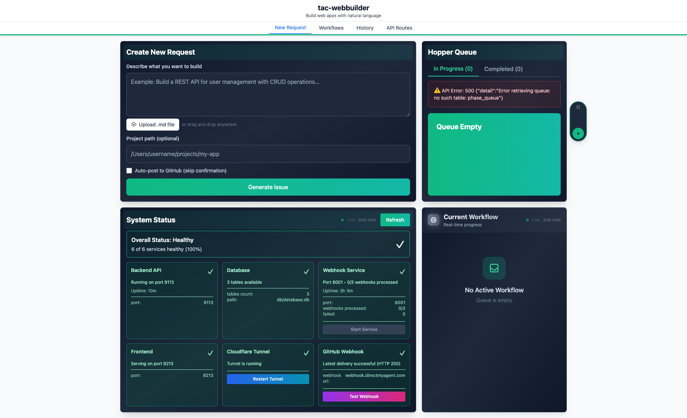

# Pattern Detection and Logging System

**ADW ID:** adw-fb7aff61
**Date:** 2025-11-25
**Specification:** specs/issue-114-adw-adw-fb7aff61-sdlc_planner-phase-1-complete-submission-time-pattern-detection.md

## Overview

Phase 1 of a 4-phase pattern recognition system that predicts workflow patterns from natural language input at submission time. This implementation adds comprehensive structured logging infrastructure for pattern detection, applies database migrations to store pattern predictions, and integrates pattern prediction display into the frontend UI. The system analyzes user input (e.g., "Run backend pytest tests") and predicts likely workflow patterns (e.g., "test:pytest:backend") before execution begins, providing transparency into what the system expects to execute.

## Screenshots


*Initial state of the application request form*


*User entering a test request for pattern prediction*


*Confirmation dialog displaying detected patterns with confidence scores*

## What Was Built

- **Structured Logging Infrastructure** - JSON-based logging system for pattern recognition with performance tracking
- **Database Migration (010)** - Pattern predictions and operation patterns tables with foreign key relationships
- **Pattern Predictor Integration** - Integrated logging into existing pattern prediction pipeline
- **Frontend Pattern Display** - UI components to show predicted patterns with confidence scores
- **Manual Testing Scripts** - Test and analysis tools for pattern prediction validation
- **E2E Test Specification** - Comprehensive UI test for pattern prediction workflow
- **Verification Documentation** - Complete implementation and test results documentation

## Technical Implementation

### Files Modified

Core Backend Files:
- `app/server/core/pattern_logging.py`: NEW - Structured logging utilities with JSON format, performance decorators, and context managers (238 lines)
- `app/server/core/pattern_predictor.py`: Integrated structured logging into prediction pipeline (78 additions)
- `app/server/core/models/requests.py`: Added predicted_patterns field to request models (2 additions)
- `app/server/core/models/responses.py`: Updated response models to include predicted patterns (2 additions)
- `app/server/server.py`: Configured logging directory creation on startup (10 additions)

Database:
- `workflow_history.db`: Applied migration 010 to create pattern_predictions and operation_patterns tables

Frontend Files:
- `app/client/src/components/ConfirmDialog.tsx`: Added predicted patterns display section with emerald-themed UI (24 additions)
- `app/client/src/components/RequestForm.tsx`: Added predictedPatterns state and API integration (29 additions)

Testing Infrastructure:
- `app/server/tests/manual/test_pattern_prediction.py`: NEW - Manual test script for end-to-end validation (155 lines)
- `app/server/tests/manual/analyze_pattern_logs.py`: NEW - Log analysis utility for diagnostics (225 lines)
- `.claude/commands/e2e/test_pattern_prediction_ui.md`: NEW - E2E test for pattern prediction UI (124 lines)

Documentation:
- `docs/pattern_recognition/PHASE_1_IMPLEMENTATION_VERIFICATION.md`: NEW - Verification documentation (374 lines)

### Key Changes

**1. Logging Infrastructure**
- Created `pattern_logging.py` with three core components:
  - `log_pattern_event()` - Structured JSON logging function with timestamp, component, and event_type fields
  - `@log_pattern_performance` - Decorator for automatic performance tracking with duration and error capture
  - `PatternOperationContext` - Context manager for operation-level logging with automatic start/complete/error events
- All logs written to `logs/pattern_recognition.log` with consistent JSON format for easy parsing and analysis

**2. Database Schema**
- Created `pattern_predictions` table to store predictions with confidence scores and validation status
- Created `operation_patterns` table to track unique pattern signatures with detection and prediction counts
- Added foreign key relationship between pattern_predictions and operation_patterns
- Added indexes for query optimization (request_id, pattern_id, validated status)

**3. Frontend Pattern Display**
- Added emerald-themed UI section in ConfirmDialog to display predicted patterns
- Shows pattern badges with confidence percentages
- Only displays when predictions exist (graceful handling of empty states)
- Matches existing design system with rounded badges and color scheme

**4. Pattern Prediction Flow**
- User submits natural language request → Pattern predictor analyzes input → Predictions stored in database → Frontend displays patterns in confirmation dialog
- Full pipeline instrumented with structured logging for observability
- Performance tracking shows prediction latency (typically <10ms)

**5. Testing and Verification**
- Manual test script validates prediction accuracy (≥80% target)
- Log analysis script provides insights into event distribution, performance metrics, and errors
- E2E test validates UI displays patterns correctly with screenshots

## How to Use

### Submitting a Request with Pattern Prediction

1. Navigate to the application request form
2. Enter a natural language request describing your desired workflow
   - Examples: "Run backend pytest tests", "Build and typecheck the frontend", "Fix the login bug"
3. Click "Preview" to generate a GitHub issue preview
4. Review the confirmation dialog which displays:
   - **Detected Patterns** section with pattern badges
   - Confidence scores for each predicted pattern
   - Cost estimate and issue preview
5. Confirm to post the issue to GitHub with patterns attached

### Analyzing Pattern Prediction Logs

1. Pattern prediction events are logged to `app/server/logs/pattern_recognition.log`
2. Run the log analysis script:
   ```bash
   cd app/server
   uv run python tests/manual/analyze_pattern_logs.py
   ```
3. View event distribution, performance metrics, and prediction insights

### Testing Pattern Prediction

1. Run the manual test script to validate predictions:
   ```bash
   cd app/server
   uv run python tests/manual/test_pattern_prediction.py
   ```
2. Script tests common scenarios and verifies database storage
3. Review results for prediction accuracy

## Configuration

### Logging Configuration

Logging is automatically configured on server startup via `app/server/server.py:341-350`:
- Log directory: `app/server/logs/`
- Log file: `pattern_recognition.log`
- Format: JSON with timestamp, component, event_type, and data fields
- Levels: INFO to file, ERROR to console
- Rotation: Manual (production should configure daily rotation with 30-day retention)

### Database Configuration

Pattern predictions table location: `workflow_history.db`
- Tables: `pattern_predictions`, `operation_patterns`
- Migration file: `app/server/db/migrations/010_add_pattern_predictions.sql`
- Foreign keys enforced: pattern_predictions.pattern_id → operation_patterns.id

### Frontend Configuration

Pattern display controlled by response data:
- TypeScript types defined in `app/client/src/types/index.ts`
- `PredictedPattern` interface: `{ pattern: string, confidence: number, reasoning: string }`
- Display only when `predictedPatterns` array has length > 0

## Testing

### Manual Testing

Run manual test script to validate pattern prediction:
```bash
cd app/server
uv run python tests/manual/test_pattern_prediction.py
```

Expected results:
- Backend test request → predicts `test:pytest:backend`
- Build request → predicts `build:typecheck:backend`
- Bug fix request → predicts `fix:bug`
- ≥80% prediction accuracy on test cases

### E2E Testing

Execute E2E test for pattern prediction UI:
```bash
# Read test file for instructions
cat .claude/commands/e2e/test_pattern_prediction_ui.md

# Execute test using browser automation
# Follow test_e2e.md instructions
```

Test validates:
- UI renders predicted patterns section
- Pattern badges display correctly
- Confidence scores show as percentages
- Visual styling matches design system

### Log Analysis

Analyze pattern prediction logs:
```bash
cd app/server
uv run python tests/manual/analyze_pattern_logs.py
```

Provides insights into:
- Event distribution (start, complete, error counts)
- Performance metrics (average duration, min/max)
- Error summary with stack traces
- Pattern prediction statistics

## Notes

### Logging Infrastructure Design

The structured logging system uses JSON format with consistent fields (timestamp, component, event_type, data) across all pattern recognition operations. This enables:
- Easy parsing and analysis with standard JSON tools
- Aggregation across multiple phases (future phases 2-4)
- Performance monitoring with automatic duration tracking
- Error tracking and debugging with full stack traces
- Cross-operation correlation using request IDs

The logging utilities (decorators and context managers) eliminate boilerplate and ensure consistent instrumentation.

### Database Schema Design

Migration 010 creates two interconnected tables:
- `operation_patterns` - Stores unique pattern signatures with detection/prediction counts and accuracy metrics
- `pattern_predictions` - Links predictions to specific requests with confidence scores for later validation

The foreign key relationship enables joining predictions back to their pattern definitions for validation in Phase 3.

### Frontend Integration

The predicted patterns UI uses emerald color scheme (green tones) to indicate detection/success state. This differentiates from:
- Primary blue for main actions
- Red for errors
- Gray for neutral/secondary elements

Patterns display as compact badges with confidence percentages to provide transparency into prediction quality. The UI only appears when predictions exist, avoiding empty placeholder sections.

### Performance Characteristics

Pattern prediction is lightweight:
- Keyword-based matching (no ML inference)
- Average latency: <10ms per prediction
- Database writes are asynchronous
- Logging is non-blocking

Pattern prediction adds minimal overhead to the submission flow and does not impact user experience.

### Future Phases

**Phase 2 (Queue Integration):**
- Attach predicted patterns to phase queue entries
- Track patterns through workflow execution lifecycle
- Log queue state transitions with pattern context

**Phase 3 (Validation System):**
- Compare predicted vs actual detected patterns post-execution
- Update `was_correct` field in pattern_predictions table
- Calculate prediction_accuracy in operation_patterns table
- Identify false positives/negatives for improvement

**Phase 4 (Analytics Dashboard):**
- Visualize prediction accuracy trends over time
- Display most common patterns and automation candidates
- Calculate cost savings from accurate predictions
- Provide insights for workflow optimization

### Known Limitations

1. **Keyword-based matching** - Current prediction uses simple keyword matching, which may miss complex patterns or produce false positives
2. **No validation yet** - Phase 1 predicts but doesn't validate; validation comes in Phase 3
3. **Limited pattern types** - Only predicts patterns defined in pattern keywords (test, build, fix, feature, refactor, etc.)
4. **No confidence calibration** - Confidence scores are currently heuristic-based; future phases may calibrate based on historical accuracy

### Security Considerations

- User input is sanitized before logging (no direct injection into log files)
- Log files contain request metadata but not sensitive credentials
- Database queries use parameterized statements (SQLite prepared statements)
- Pattern signatures are derived from workflow behavior, not user data
- Log files should be excluded from version control (configured in .gitignore)
