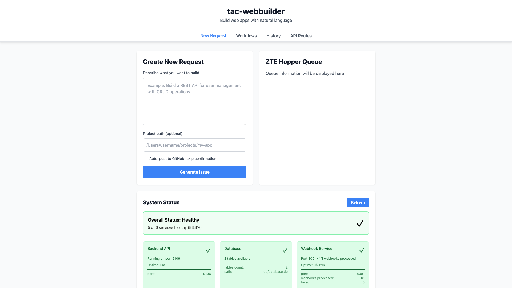

# ZTE Hopper Queue Card

**ADW ID:** c80e348c
**Date:** 2025-11-20
**Specification:** specs/issue-58-adw-c80e348c-sdlc_planner-add-a-new-zte-hopper-queue-card-to-the-right-of-th.md

## Overview

Added a new "ZTE Hopper Queue" card component that displays alongside the existing "Create New Request" card in a two-column grid layout. The cards have matching heights and consistent spacing, creating a balanced visual layout on the Request tab.

## Screenshots




## What Was Built

- New `ZteHopperQueueCard` component displaying ZTE Hopper Queue interface placeholder
- Modified `RequestForm` component layout from single-column to two-column grid
- Equal-height card layout using CSS Grid
- E2E test specification for validating the layout and spacing
- Consistent spacing (1.5rem gap) between cards matching the existing design system

## Technical Implementation

### Files Modified

- `app/client/src/components/ZteHopperQueueCard.tsx`: New component created with consistent styling (white background, rounded corners, shadow, padding)
- `app/client/src/components/RequestForm.tsx`: Layout updated to use CSS Grid with two columns, imported and rendered the new ZteHopperQueueCard component
- `.claude/commands/e2e/test_zte_hopper_queue_card.md`: New E2E test specification to validate layout, spacing, and height matching

### Key Changes

- Created `ZteHopperQueueCard` component at app/client/src/components/ZteHopperQueueCard.tsx:1 with matching card styling (bg-white, rounded-lg, shadow, p-6, h-full)
- Modified RequestForm layout at app/client/src/components/RequestForm.tsx:150 to use `grid grid-cols-2 gap-6` for two-column layout
- Imported ZteHopperQueueCard at app/client/src/components/RequestForm.tsx:8
- Rendered ZteHopperQueueCard at app/client/src/components/RequestForm.tsx:244 in the right column
- Both cards use `h-full` class to ensure equal heights through CSS Grid
- System Status Panel remains below both cards with consistent spacing
- Created E2E test specification at .claude/commands/e2e/test_zte_hopper_queue_card.md:1 to validate the layout

## How to Use

1. Navigate to the application at http://localhost:5173 (or your configured port)
2. The Request tab now displays two cards side by side:
   - Left: "Create New Request" card (existing functionality)
   - Right: "ZTE Hopper Queue" card (new component)
3. Both cards have equal heights and consistent spacing
4. The System Status Panel remains below both cards

## Configuration

No configuration required. The layout automatically adjusts using CSS Grid with:
- Two-column grid layout (`grid-cols-2`)
- 1.5rem gap between columns (`gap-6`)
- Equal height cards through CSS Grid (`h-full` on card contents)

## Testing

Run the E2E test to validate the layout:

```bash
# Read and execute the E2E test specification
cat .claude/commands/e2e/test_zte_hopper_queue_card.md
```

The test validates:
- Both cards are visible
- Cards are side by side (not stacked)
- Both cards have matching heights
- Spacing between cards is consistent
- System Status Panel is positioned below both cards

## Notes

- This is the foundational UI structure for the ZTE Hopper Queue functionality
- The card currently displays placeholder text: "Queue information will be displayed here"
- Future iterations will add queue data fetching and display logic
- CSS Grid automatically ensures equal heights for both cards
- The spacing value (gap-6 = 1.5rem) matches the existing design system spacing used between RequestForm and SystemStatusPanel
- The layout maintains the existing max-width constraint (max-w-4xl = 896px centered container)
- Consider adding responsive behavior for mobile devices in future iterations
