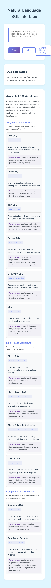

# Workflows Documentation Tab

**ADW ID:** d2ac5466
**Date:** 2025-11-13
**Specification:** specs/issue-1-adw-d2ac5466-sdlc_planner-workflows-documentation-tab.md

## Overview

This feature adds a comprehensive workflows documentation section to the Natural Language SQL Interface application. It displays all 12 available ADW (AI Developer Workflow) scripts in a clean, two-column layout organized by workflow category. This provides developers with clear, accessible documentation about automation options for GitHub issue processing.

## Screenshots


The workflows section appears below the Available Tables section, showing all workflows organized by category.



On mobile devices, the two-column layout stacks vertically for optimal readability.


Desktop view shows the two-column layout with workflow names on the left and detailed descriptions on the right.

## What Was Built

- **Workflows data module** (`app/client/src/workflows.ts`) containing all 12 ADW workflow definitions with descriptions and use cases
- **Workflows display section** integrated into the main application interface
- **Two-column responsive layout** that adapts to mobile and desktop viewports
- **Category-based organization** grouping workflows by type (Single Phase, Multi-Phase, Complete SDLC)
- **TypeScript type definitions** for workflow data structures
- **Comprehensive E2E test** validating the workflows section displays correctly
- **Visual styling** matching existing application design patterns

## Technical Implementation

### Files Modified

- `app/client/index.html:52-57` - Added workflows section HTML structure with container and introductory text
- `app/client/src/main.ts:14,529-638` - Added `displayWorkflows()` function and initialization logic to render workflow items with category grouping
- `app/client/src/style.css:546-700` - Added complete CSS styling for workflows section including two-column grid layout, hover effects, and mobile responsive breakpoints
- `app/client/src/types.d.ts:6-14` - Added `Workflow` interface defining workflow data structure with name, script_name, description, use_case, and category
- `app/client/src/workflows.ts` - New module with workflow data constants, helper functions, and category definitions

### Key Changes

- **Workflow data structure**: Created TypeScript interface with fields for name, script_name, description, use_case, and category (single-phase, multi-phase, full-sdlc)
- **Category-based rendering**: Workflows are grouped into three categories with headers and descriptions, making it easier to find the right workflow
- **Two-column responsive grid**: Desktop view uses 30%/70% split for name/description, mobile stacks vertically
- **Dynamic DOM generation**: JavaScript creates all workflow elements programmatically from the workflows array
- **Hover interactions**: Cards lift and highlight on hover to improve interactivity
- **Consistent styling**: Uses existing CSS variables and design patterns from the tables section

## How to Use

1. **Navigate to the application** - Open the Natural Language SQL Interface in your browser
2. **Scroll to workflows section** - The "Available ADW Workflows" section appears below the database tables
3. **Browse by category** - Workflows are organized into three groups:
   - **Single Phase Workflows**: Targeted operations (plan, build, test, review, document, ship)
   - **Multi-Phase Workflows**: Combinations of phases (plan+build, plan+build+test, etc.)
   - **Complete SDLC Workflows**: Full lifecycle automation (sdlc_iso, sdlc_zte_iso)
4. **Read workflow details** - Each workflow shows:
   - **Name**: Human-readable workflow name
   - **Script name**: The actual script to invoke (e.g., `adw_plan_iso`)
   - **Description**: What the workflow does
   - **When to use**: Guidance on appropriate use cases
5. **Mobile viewing** - On smaller screens, the layout automatically stacks for easy reading

## Configuration

No configuration is required. The workflows are statically defined in `app/client/src/workflows.ts` and automatically displayed when the application loads.

To add or modify workflows:
1. Edit the `workflows` array in `app/client/src/workflows.ts`
2. Follow the existing data structure with name, script_name, description, use_case, and category
3. Rebuild the frontend: `cd app/client && bun run build`

## Testing

The feature includes a comprehensive E2E test that validates:
- All 12 workflows are displayed correctly
- Two-column layout renders properly on desktop
- Layout stacks appropriately on mobile viewports
- Category headers and descriptions appear
- Hover effects work as expected
- Section follows accessibility best practices

Run the E2E test:
```bash
# Read and execute the test specification
# See .claude/commands/e2e/test_workflows_documentation.md
```

Additional validation:
```bash
# Run server tests (zero regressions)
cd app/server && uv run pytest

# Validate TypeScript compilation
cd app/client && bun tsc --noEmit

# Build frontend
cd app/client && bun run build
```

## Notes

### Workflow Categories Explained

**Single Phase Workflows** are isolated operations for specific development phases:
- `adw_plan_iso` - Planning only
- `adw_build_iso` - Implementation only
- `adw_test_iso` - Testing only
- `adw_review_iso` - Code review only
- `adw_document_iso` - Documentation only
- `adw_ship_iso` - PR merge only

**Multi-Phase Workflows** combine multiple phases:
- `adw_plan_build_iso` - Plan + Build
- `adw_plan_build_test_iso` - Plan + Build + Test
- `adw_plan_build_test_review_iso` - Plan + Build + Test + Review
- `adw_patch_iso` - Quick patch workflow for urgent fixes

**Complete SDLC Workflows** provide full automation:
- `adw_sdlc_iso` - Complete SDLC requiring manual PR approval
- `adw_sdlc_zte_iso` - Zero Touch Execution with automatic PR merge

### Design Considerations

- The workflows section uses the same visual design language as the tables section for consistency
- Two-column layout optimizes space: 30% for workflow names, 70% for descriptions
- Mobile breakpoint at 768px ensures readability on all devices
- Hover effects provide visual feedback and improve interactivity
- Category grouping helps users quickly find the appropriate workflow for their needs

### Future Enhancements

Potential improvements for this feature:
- Add search/filter functionality to find specific workflows quickly
- Make workflow names clickable to show expanded documentation
- Display workflow execution status or history
- Add direct links to ADW documentation or workflow source code
- Include estimated execution time for each workflow
- Show dependency relationships between workflows
